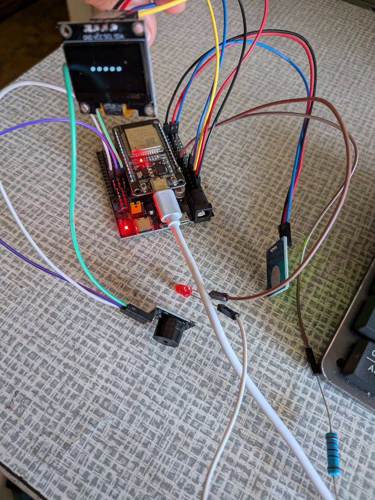

# Desktop Air Alert

## About
When in your city/region start air alert, enable sound by buzzer, which you can turn off by sensor touch. Also it will blank by LED diod

## Prerequisites
VSCode extension: [PlatformIO](https://marketplace.visualstudio.com/items?itemName=platformio.platformio-ide)

## Used elements
1. ESP32
2. Devboard
3. Passive buzzer
4. Sensor touch
5. OLEd 0.96 display
6. LED diod
7. Resistor kOm 220

## API
Documentation about API: [alerts.in.ua](https://devs.alerts.in.ua/)
Location IDs: https://devs.alerts.in.ua/#modeluid

## Quickstart
1. Clone repo
```sh
git clone https://github.com/T0rquemada/desc-air-alert-notifier.git
```
2. Rename platformio.ini.example to platformio.ini
3. Enter wifi ssid and password in platformio.ini
4. Get API key from [API docs](https://devs.alerts.in.ua/#documentationauthentication)
5. Open project by PlatformIO


